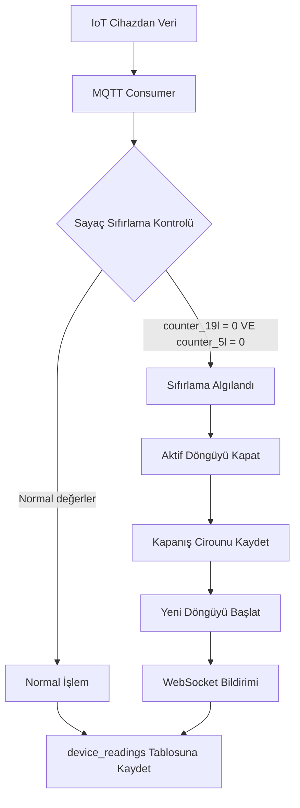

# Aylık Ciro Takip Sistemi - Tasarım Planı

## Genel Bakış

Cihazlar ay başında manuel sıfırlandığında, sayaç değerleri 0'a düşer. Sistem bu durumu otomatik olarak algılayıp yeni ay başladı saymalı ve önceki ayın son değerlerini o ayın cirosu olarak kaydetmelidir.

## İş Akışı



## Veritabanı Değişiklikleri

### 1. Yeni Tablo: `device_month_cycles`

Her cihazın aylık döngülerini takip etmek için:

```sql
CREATE TABLE device_month_cycles (
    id BIGINT PRIMARY KEY AUTOINCREMENT,
    device_id INTEGER NOT NULL,
    cycle_start_date DATETIME NOT NULL,
    cycle_end_date DATETIME,
    start_counter_19l INTEGER DEFAULT 0,
    start_counter_5l INTEGER DEFAULT 0,
    end_counter_19l INTEGER,
    end_counter_5l INTEGER,
    total_revenue INTEGER DEFAULT 0,
    year INTEGER NOT NULL,
    month INTEGER NOT NULL,
    is_closed BOOLEAN DEFAULT 0,
    created_at DATETIME DEFAULT CURRENT_TIMESTAMP,
    updated_at DATETIME DEFAULT CURRENT_TIMESTAMP,
    FOREIGN KEY (device_id) REFERENCES devices(id) ON DELETE CASCADE
);

CREATE INDEX idx_device_month_cycles_device_id ON device_month_cycles(device_id);
CREATE INDEX idx_device_month_cycles_year_month ON device_month_cycles(year, month);
CREATE INDEX idx_device_month_cycles_is_closed ON device_month_cycles(is_closed);
```

### 2. Yeni Tablo: `monthly_revenue_records`

Tüm cihazların aylık özet cirolarını tutmak için:

```sql
CREATE TABLE monthly_revenue_records (
    id BIGINT PRIMARY KEY AUTOINCREMENT,
    device_id INTEGER NOT NULL,
    year INTEGER NOT NULL,
    month INTEGER NOT NULL,
    month_start_date DATETIME NOT NULL,
    month_end_date DATETIME,
    closing_counter_19l INTEGER,
    closing_counter_5l INTEGER,
    total_revenue INTEGER DEFAULT 0,
    is_closed BOOLEAN DEFAULT 0,
    created_at DATETIME DEFAULT CURRENT_TIMESTAMP,
    updated_at DATETIME DEFAULT CURRENT_TIMESTAMP,
    UNIQUE(device_id, year, month),
    FOREIGN KEY (device_id) REFERENCES devices(id) ON DELETE CASCADE
);

CREATE INDEX idx_monthly_revenue_records_year_month ON monthly_revenue_records(year, month);
CREATE INDEX idx_monthly_revenue_records_device_id ON monthly_revenue_records(device_id);
```

## Backend Değişiklikleri

### 1. Yeni Model Dosyaları

#### `backend/app/models/device_month_cycle.py`

```python
"""
Device Month Cycle Model
Aylık döngü takibi için model
"""
from datetime import datetime
from typing import Optional

from sqlalchemy import Boolean, Integer, BigInteger, DateTime, ForeignKey
from sqlalchemy.orm import Mapped, mapped_column

from app.database import Base


class DeviceMonthCycle(Base):
    """Cihaz aylık döngü modeli"""
    
    __tablename__ = "device_month_cycles"
    
    id: Mapped[int] = mapped_column(BigInteger, primary_key=True, autoincrement=True)
    device_id: Mapped[int] = mapped_column(
        Integer,
        ForeignKey("devices.id", ondelete="CASCADE"),
        nullable=False,
        index=True
    )
    
    cycle_start_date: Mapped[datetime] = mapped_column(
        DateTime(timezone=True),
        nullable=False
    )
    cycle_end_date: Mapped[Optional[datetime]] = mapped_column(
        DateTime(timezone=True),
        nullable=True
    )
    
    start_counter_19l: Mapped[int] = mapped_column(Integer, default=0, nullable=False)
    start_counter_5l: Mapped[int] = mapped_column(Integer, default=0, nullable=False)
    
    end_counter_19l: Mapped[Optional[int]] = mapped_column(Integer, nullable=True)
    end_counter_5l: Mapped[Optional[int]] = mapped_column(Integer, nullable=True)
    
    total_revenue: Mapped[int] = mapped_column(Integer, default=0, nullable=False)
    
    year: Mapped[int] = mapped_column(Integer, nullable=False)
    month: Mapped[int] = mapped_column(Integer, nullable=False)
    
    is_closed: Mapped[bool] = mapped_column(Boolean, default=False, nullable=False, index=True)
    
    created_at: Mapped[datetime] = mapped_column(
        DateTime(timezone=True),
        default=datetime.utcnow,
        nullable=False
    )
    updated_at: Mapped[datetime] = mapped_column(
        DateTime(timezone=True),
        default=datetime.utcnow,
        onupdate=datetime.utcnow,
        nullable=False
    )

    def __repr__(self) -> str:
        return f"<DeviceMonthCycle(device_id={self.device_id}, year={self.year}, month={self.month}, revenue={self.total_revenue})>"
```

#### `backend/app/models/monthly_revenue.py`

```python
"""
Monthly Revenue Record Model
Aylık ciro kayıtları için model
"""
from datetime import datetime
from typing import Optional

from sqlalchemy import Boolean, Integer, BigInteger, DateTime, ForeignKey, UniqueConstraint
from sqlalchemy.orm import Mapped, mapped_column

from app.database import Base


class MonthlyRevenueRecord(Base):
    """Aylık ciro kayıt modeli"""
    
    __tablename__ = "monthly_revenue_records"
    
    id: Mapped[int] = mapped_column(BigInteger, primary_key=True, autoincrement=True)
    device_id: Mapped[int] = mapped_column(
        Integer,
        ForeignKey("devices.id", ondelete="CASCADE"),
        nullable=False,
        index=True
    )
    
    year: Mapped[int] = mapped_column(Integer, nullable=False, index=True)
    month: Mapped[int] = mapped_column(Integer, nullable=False, index=True)
    
    month_start_date: Mapped[datetime] = mapped_column(
        DateTime(timezone=True),
        nullable=False
    )
    month_end_date: Mapped[Optional[datetime]] = mapped_column(
        DateTime(timezone=True),
        nullable=True
    )
    
    closing_counter_19l: Mapped[Optional[int]] = mapped_column(Integer, nullable=True)
    closing_counter_5l: Mapped[Optional[int]] = mapped_column(Integer, nullable=True)
    
    total_revenue: Mapped[int] = mapped_column(Integer, default=0, nullable=False)
    
    is_closed: Mapped[bool] = mapped_column(Boolean, default=False, nullable=False)
    
    created_at: Mapped[datetime] = mapped_column(
        DateTime(timezone=True),
        default=datetime.utcnow,
        nullable=False
    )
    updated_at: Mapped[datetime] = mapped_column(
        DateTime(timezone=True),
        default=datetime.utcnow,
        onupdate=datetime.utcnow,
        nullable=False
    )
    
    __table_args__ = (
        UniqueConstraint('device_id', 'year', 'month', name='unique_device_year_month'),
    )

    def __repr__(self) -> str:
        return f"<MonthlyRevenueRecord(device_id={self.device_id}, year={self.year}, month={self.month}, revenue={self.total_revenue})>"
```

### 2. Yeni Servis: `MonthlyRevenueService`

#### `backend/app/services/monthly_revenue_service.py`

```python
"""
Monthly Revenue Service
Aylık ciro takip ve yönetim servisi
"""
from datetime import datetime, timedelta
from typing import Optional, List, Dict, Any
from sqlalchemy import select, and_, desc
from sqlalchemy.ext.asyncio import AsyncSession

from app.models.device import Device
from app.models.reading import DeviceReading
from app.models.device_month_cycle import DeviceMonthCycle
from app.models.monthly_revenue import MonthlyRevenueRecord
from app.core.exceptions import NotFoundException


class MonthlyRevenueService:
    """Aylık ciro yönetim servisi"""
    
    # Sıfırlama algılama eşik değerleri
    RESET_THRESHOLD = 5  # Sayaç değeri bu değerden azsa sıfırlama sayılır
    MIN_DAYS_BETWEEN_RESETS = 15  # Ard arda sıfırlamalar arası minimum gün
    RESET_DROP_PERCENTAGE = 0.9  # Önceki değerin %90'ından fazla düşüş sıfırlama sayılır
    
    @staticmethod
    async def detect_counter_reset(
        db: AsyncSession,
        device_id: int,
        counter_19l: int,
        counter_5l: int,
        timestamp: datetime
    ) -> bool:
        """
        Sayaç sıfırlamasını algıla
        
        Args:
            db: Veritabanı oturumu
            device_id: Cihaz ID
            counter_19l: 19L sayacı değeri
            counter_5l: 5L sayacı değeri
            timestamp: Okuma zamanı
            
        Returns:
            True if reset detected, False otherwise
        """
        # Her iki sayaç da 0'a yakın mı?
        if counter_19l > MonthlyRevenueService.RESET_THRESHOLD or counter_5l > MonthlyRevenueService.RESET_THRESHOLD:
            return False
        
        # Son okumayı getir
        last_reading_result = await db.execute(
            select(DeviceReading)
            .where(DeviceReading.device_id == device_id)
            .where(DeviceReading.counter_19l.isnot(None))
            .where(DeviceReading.counter_5l.isnot(None))
            .order_by(DeviceReading.timestamp.desc())
            .limit(1)
        )
        last_reading = last_reading_result.scalar_one_or_none()
        
        if not last_reading:
            # İlk okuma - sıfırlama değil, ilk döngü başlangıcı
            await MonthlyRevenueService._create_first_cycle(db, device_id, timestamp)
            return False
        
        # Son sıfırlamadan ne kadar zaman geçti?
        last_reset_result = await db.execute(
            select(DeviceMonthCycle)
            .where(DeviceMonthCycle.device_id == device_id)
            .where(DeviceMonthCycle.is_closed == True)
            .order_by(DeviceMonthCycle.cycle_end_date.desc())
            .limit(1)
        )
        last_reset = last_reset_result.scalar_one_or_none()
        
        if last_reset and last_reset.cycle_end_date:
            days_since_reset = (timestamp - last_reset.cycle_end_date).days
            if days_since_reset < MonthlyRevenueService.MIN_DAYS_BETWEEN_RESETS:
                # Çok kısa sürede ikinci sıfırlama - ignore et
                return False
        
        # Önceki değerlerden belirgin düşüş var mı?
        prev_19l = last_reading.counter_19l or 0
        prev_5l = last_reading.counter_5l or 0
        
        if prev_19l > 0:
            drop_19l = (prev_19l - counter_19l) / prev_19l
        else:
            drop_19l = 1.0
            
        if prev_5l > 0:
            drop_5l = (prev_5l - counter_5l) / prev_5l
        else:
            drop_5l = 1.0
        
        # Her iki sayaçta da belirgin düşüş var mı?
        if drop_19l >= MonthlyRevenueService.RESET_DROP_PERCENTAGE and drop_5l >= MonthlyRevenueService.RESET_DROP_PERCENTAGE:
            # Sıfırlama algılandı - ayı kapat
            await MonthlyRevenueService.close_month_cycle(
                db, device_id, prev_19l, prev_5l, timestamp
            )
            return True
        
        return False
    
    @staticmethod
    async def _create_first_cycle(
        db: AsyncSession,
        device_id: int,
        timestamp: datetime
    ):
        """İlk döngüyü oluştur"""
        cycle = DeviceMonthCycle(
            device_id=device_id,
            cycle_start_date=timestamp,
            start_counter_19l=0,
            start_counter_5l=0,
            year=timestamp.year,
            month=timestamp.month,
            is_closed=False
        )
        db.add(cycle)
        await db.commit()
    
    @staticmethod
    async def close_month_cycle(
        db: AsyncSession,
        device_id: int,
        closing_counter_19l: int,
        closing_counter_5l: int,
        timestamp: datetime
    ):
        """
        Aktif aylık döngüyü kapat ve ciroyu kaydet
        
        Args:
            db: Veritabanı oturumu
            device_id: Cihaz ID
            closing_counter_19l: Kapanış 19L değeri
            closing_counter_5l: Kapanış 5L değeri
            timestamp: Kapanış zamanı
        """
        # Aktif döngüyü bul
        active_cycle_result = await db.execute(
            select(DeviceMonthCycle)
            .where(DeviceMonthCycle.device_id == device_id)
            .where(DeviceMonthCycle.is_closed == False)
            .order_by(DeviceMonthCycle.cycle_start_date.desc())
            .limit(1)
        )
        active_cycle = active_cycle_result.scalar_one_or_none()
        
        if not active_cycle:
            # Aktif döngü yok - yeni oluştur
            await MonthlyRevenueService._create_first_cycle(db, device_id, timestamp)
            return
        
        # Döngüyü kapat
        active_cycle.cycle_end_date = timestamp
        active_cycle.end_counter_19l = closing_counter_19l
        active_cycle.end_counter_5l = closing_counter_5l
        active_cycle.total_revenue = closing_counter_19l + closing_counter_5l
        active_cycle.is_closed = True
        active_cycle.updated_at = datetime.utcnow()
        
        # Aylık ciro kaydı oluştur veya güncelle
        await MonthlyRevenueService._create_or_update_monthly_record(
            db, device_id, active_cycle.year, active_cycle.month,
            active_cycle.cycle_start_date, timestamp,
            closing_counter_19l, closing_counter_5l,
            active_cycle.total_revenue
        )
        
        # Yeni döngüyü başlat
        new_cycle = DeviceMonthCycle(
            device_id=device_id,
            cycle_start_date=timestamp,
            start_counter_19l=0,
            start_counter_5l=0,
            year=timestamp.year,
            month=timestamp.month,
            is_closed=False
        )
        db.add(new_cycle)
        
        await db.commit()
    
    @staticmethod
    async def _create_or_update_monthly_record(
        db: AsyncSession,
        device_id: int,
        year: int,
        month: int,
        month_start: datetime,
        month_end: datetime,
        counter_19l: int,
        counter_5l: int,
        total_revenue: int
    ):
        """Aylık ciro kaydı oluştur veya güncelle"""
        # Mevcut kaydı kontrol et
        existing_result = await db.execute(
            select(MonthlyRevenueRecord)
            .where(MonthlyRevenueRecord.device_id == device_id)
            .where(MonthlyRevenueRecord.year == year)
            .where(MonthlyRevenueRecord.month == month)
        )
        existing = existing_result.scalar_one_or_none()
        
        if existing:
            # Güncelle
            existing.month_end_date = month_end
            existing.closing_counter_19l = counter_19l
            existing.closing_counter_5l = counter_5l
            existing.total_revenue = total_revenue
            existing.is_closed = True
            existing.updated_at = datetime.utcnow()
        else:
            # Yeni kayıt
            record = MonthlyRevenueRecord(
                device_id=device_id,
                year=year,
                month=month,
                month_start_date=month_start,
                month_end_date=month_end,
                closing_counter_19l=counter_19l,
                closing_counter_5l=counter_5l,
                total_revenue=total_revenue,
                is_closed=True
            )
            db.add(record)
    
    @staticmethod
    async def get_current_month_revenue(
        db: AsyncSession,
        device_id: Optional[int] = None
    ) -> List[Dict[str, Any]]:
        """
        Mevcut ayın cirosunu getir
        
        Args:
            db: Veritabanı oturumu
            device_id: Opsiyonel cihaz filtresi
            
        Returns:
            Mevcut ay ciro listesi
        """
        now = datetime.utcnow()
        year = now.year
        month = now.month
        
        query = select(MonthlyRevenueRecord).where(
            MonthlyRevenueRecord.year == year
        ).where(
            MonthlyRevenueRecord.month == month
        )
        
        if device_id:
            query = query.where(MonthlyRevenueRecord.device_id == device_id)
        
        result = await db.execute(query)
        records = result.scalars().all()
        
        return [
            {
                "device_id": r.device_id,
                "year": r.year,
                "month": r.month,
                "total_revenue": r.total_revenue,
                "closing_counter_19l": r.closing_counter_19l,
                "closing_counter_5l": r.closing_counter_5l,
                "is_closed": r.is_closed,
            }
            for r in records
        ]
    
    @staticmethod
    async def get_monthly_revenue_summary(
        db: AsyncSession,
        year: int,
        month: int
    ) -> Dict[str, Any]:
        """
        Aylık ciro özeti getir
        
        Args:
            db: Veritabanı oturumu
            year: Yıl
            month: Ay
            
        Returns:
            Aylık özet
        """
        # Tüm cihazların o ay cirosu
        result = await db.execute(
            select(MonthlyRevenueRecord).where(
                MonthlyRevenueRecord.year == year
            ).where(
                MonthlyRevenueRecord.month == month
            )
        )
        records = result.scalars().all()
        
        total_revenue = sum(r.total_revenue for r in records)
        total_19l = sum(r.closing_counter_19l or 0 for r in records)
        total_5l = sum(r.closing_counter_5l or 0 for r in records)
        
        return {
            "year": year,
            "month": month,
            "total_revenue": total_revenue,
            "total_19l": total_19l,
            "total_5l": total_5l,
            "device_count": len(records),
            "closed_count": sum(1 for r in records if r.is_closed),
        }
    
    @staticmethod
    async def get_device_month_cycles(
        db: AsyncSession,
        device_id: int,
        limit: int = 12
    ) -> List[Dict[str, Any]]:
        """
        Cihazın aylık döngülerini getir
        
        Args:
            db: Veritabanı oturumu
            device_id: Cihaz ID
            limit: Maksimum kayıt sayısı
            
        Returns:
            Döngü listesi
        """
        result = await db.execute(
            select(DeviceMonthCycle)
            .where(DeviceMonthCycle.device_id == device_id)
            .order_by(DeviceMonthCycle.cycle_start_date.desc())
            .limit(limit)
        )
        cycles = result.scalars().all()
        
        return [
            {
                "cycle_start_date": c.cycle_start_date.isoformat(),
                "cycle_end_date": c.cycle_end_date.isoformat() if c.cycle_end_date else None,
                "start_counter_19l": c.start_counter_19l,
                "start_counter_5l": c.start_counter_5l,
                "end_counter_19l": c.end_counter_19l,
                "end_counter_5l": c.end_counter_5l,
                "total_revenue": c.total_revenue,
                "year": c.year,
                "month": c.month,
                "is_closed": c.is_closed,
            }
            for c in cycles
        ]
```

### 3. MQTT Consumer Güncellemesi

`backend/app/services/mqtt_consumer.py` dosyasına sıfırlama kontrolü eklenmeli:

```python
# Mevcut import'lara ekle
from app.services.monthly_revenue_service import MonthlyRevenueService

# process_reading fonksiyonuna ekle:
async def process_reading(...):
    # ... mevcut kodlar ...
    
    # Sayaç sıfırlama kontrolü
    if counter_19l is not None and counter_5l is not None:
        reset_detected = await MonthlyRevenueService.detect_counter_reset(
            db, device.id, counter_19l, counter_5l, timestamp
        )
        
        if reset_detected:
            # WebSocket bildirimi gönder
            await websocket_manager.broadcast({
                "type": "month_closed",
                "device_id": device.id,
                "device_name": device.name,
                "timestamp": timestamp.isoformat(),
            })
    
    # ... mevcut kodlara devam et ...
```

### 4. Yeni API Endpoint'leri

#### `backend/app/api/v1/monthly_revenue.py`

```python
"""
Monthly Revenue API Endpoints
Aylık ciro API endpoint'leri
"""
from datetime import datetime
from typing import Optional, List
from fastapi import APIRouter, Depends, Query
from sqlalchemy.ext.asyncio import AsyncSession

from app.api.deps import get_db
from app.services.monthly_revenue_service import MonthlyRevenueService

router = APIRouter()


@router.get("/current")
async def get_current_month_revenue(
    device_id: Optional[int] = Query(None),
    db: AsyncSession = Depends(get_db),
):
    """Mevcut ayın cirosunu getir"""
    return await MonthlyRevenueService.get_current_month_revenue(db, device_id)


@router.get("/summary")
async def get_monthly_revenue_summary(
    year: int = Query(...),
    month: int = Query(..., ge=1, le=12),
    db: AsyncSession = Depends(get_db),
):
    """Aylık ciro özetini getir"""
    return await MonthlyRevenueService.get_monthly_revenue_summary(db, year, month)


@router.get("/device/{device_id}/cycles")
async def get_device_month_cycles(
    device_id: int,
    limit: int = Query(12, ge=1, le=100),
    db: AsyncSession = Depends(get_db),
):
    """Cihazın aylık döngülerini getir"""
    return await MonthlyRevenueService.get_device_month_cycles(db, device_id, limit)


@router.get("/history")
async def get_monthly_revenue_history(
    year: Optional[int] = Query(None),
    device_id: Optional[int] = Query(None),
    db: AsyncSession = Depends(get_db),
):
    """Aylık ciro geçmişini getir"""
    # Implementasyon
    pass
```

## Frontend Değişiklikleri

### 1. Yeni TypeScript Tipleri

#### `frontend/src/types/monthly_revenue.ts`

```typescript
export interface MonthlyRevenueRecord {
  device_id: number;
  year: number;
  month: number;
  total_revenue: number;
  closing_counter_19l: number | null;
  closing_counter_5l: number | null;
  is_closed: boolean;
}

export interface DeviceMonthCycle {
  cycle_start_date: string;
  cycle_end_date: string | null;
  start_counter_19l: number;
  start_counter_5l: number;
  end_counter_19l: number | null;
  end_counter_5l: number | null;
  total_revenue: number;
  year: number;
  month: number;
  is_closed: boolean;
}

export interface MonthlyRevenueSummary {
  year: number;
  month: number;
  total_revenue: number;
  total_19l: number;
  total_5l: number;
  device_count: number;
  closed_count: number;
}
```

### 2. API İstemcisi Güncellemeleri

#### `frontend/src/lib/api.ts`'e ekle:

```typescript
// Aylık ciro API fonksiyonları

export async function getCurrentMonthRevenue(deviceId?: number) {
  const params = deviceId ? `?device_id=${deviceId}` : '';
  const response = await fetch(`${API_BASE_URL}/api/v1/monthly-revenue/current${params}`);
  if (!response.ok) throw new Error('Mevcut ay cirosu alınamadı');
  return response.json() as Promise<MonthlyRevenueRecord[]>;
}

export async function getMonthlyRevenueSummary(year: number, month: number) {
  const response = await fetch(
    `${API_BASE_URL}/api/v1/monthly-revenue/summary?year=${year}&month=${month}`
  );
  if (!response.ok) throw new Error('Aylık özet alınamadı');
  return response.json() as Promise<MonthlyRevenueSummary>;
}

export async function getDeviceMonthCycles(deviceId: number, limit = 12) {
  const response = await fetch(
    `${API_BASE_URL}/api/v1/monthly-revenue/device/${deviceId}/cycles?limit=${limit}`
  );
  if (!response.ok) throw new Error('Aylık döngüler alınamadı');
  return response.json() as Promise<DeviceMonthCycle[]>;
}
```

### 3. Dashboard Güncellemeleri

#### `frontend/src/app/(dashboard)/page.tsx` güncellemeleri:

- Aylık ciro kartlarını yeni API'den çek
- Mevcut ayın aktif döngüsünü göster
- Ay kapatma bildirimleri için WebSocket dinleyicisi ekle

### 4. Yeni Sayfa: Aylık Ciro Raporu

#### `frontend/src/app/(dashboard)/monthly-revenue/page.tsx`:

```typescript
'use client';

import { useState, useEffect } from 'react';
import { Card, CardContent, CardHeader, CardTitle } from '@/components/ui/card';
import { Table, TableBody, TableCell, TableHead, TableHeader, TableRow } from '@/components/ui/table';
import { Select, SelectContent, SelectItem, SelectTrigger, SelectValue } from '@/components/ui/select';
import { formatMoney } from '@/lib/utils';
import type { MonthlyRevenueRecord } from '@/types/monthly_revenue';

export default function MonthlyRevenuePage() {
  const [selectedYear, setSelectedYear] = useState(new Date().getFullYear());
  const [selectedMonth, setSelectedMonth] = useState(new Date().getMonth() + 1);
  const [revenueData, setRevenueData] = useState<MonthlyRevenueRecord[]>([]);
  const [isLoading, setIsLoading] = useState(true);

  useEffect(() => {
    fetchMonthlyRevenue();
  }, [selectedYear, selectedMonth]);

  const fetchMonthlyRevenue = async () => {
    setIsLoading(true);
    try {
      const response = await fetch(
        `/api/v1/monthly-revenue/history?year=${selectedYear}&month=${selectedMonth}`
      );
      const data = await response.json();
      setRevenueData(data);
    } catch (error) {
      console.error('Failed to fetch monthly revenue:', error);
    } finally {
      setIsLoading(false);
    }
  };

  return (
    <div className="space-y-6">
      <div className="flex items-center justify-between">
        <div>
          <h1 className="text-3xl font-bold tracking-tight">Aylık Ciro Raporu</h1>
          <p className="text-muted-foreground">
            Tüm cihazların aylık ciro kayıtları
          </p>
        </div>
        <div className="flex gap-2">
          <Select value={selectedYear.toString()} onValueChange={(v) => setSelectedYear(parseInt(v))}>
            <SelectTrigger className="w-[120px]">
              <SelectValue />
            </SelectTrigger>
            <SelectContent>
              {[2025, 2026, 2027].map(year => (
                <SelectItem key={year} value={year.toString()}>{year}</SelectItem>
              ))}
            </SelectContent>
          </Select>
          <Select value={selectedMonth.toString()} onValueChange={(v) => setSelectedMonth(parseInt(v))}>
            <SelectTrigger className="w-[120px]">
              <SelectValue />
            </SelectTrigger>
            <SelectContent>
              {['Ocak', 'Şubat', 'Mart', 'Nisan', 'Mayıs', 'Haziran', 
                'Temmuz', 'Ağustos', 'Eylül', 'Ekim', 'Kasım', 'Aralık'].map((m, i) => (
                <SelectItem key={i + 1} value={(i + 1).toString()}>{m}</SelectItem>
              ))}
            </SelectContent>
          </Select>
        </div>
      </div>

      <Card>
        <CardHeader>
          <CardTitle>Cihaz Bazlı Aylık Ciro</CardTitle>
        </CardHeader>
        <CardContent>
          <Table>
            <TableHeader>
              <TableRow>
                <TableHead>Cihaz ID</TableHead>
                <TableHead>19L</TableHead>
                <TableHead>5L</TableHead>
                <TableHead>Toplam</TableHead>
                <TableHead>Durum</TableHead>
              </TableRow>
            </TableHeader>
            <TableBody>
              {revenueData.map(record => (
                <TableRow key={record.device_id}>
                  <TableCell>{record.device_id}</TableCell>
                  <TableCell>{formatMoney(record.closing_counter_19l || 0)}</TableCell>
                  <TableCell>{formatMoney(record.closing_counter_5l || 0)}</TableCell>
                  <TableCell className="font-bold">{formatMoney(record.total_revenue)}</TableCell>
                  <TableCell>
                    {record.is_closed ? 'Kapalı' : 'Aktif'}
                  </TableCell>
                </TableRow>
              ))}
            </TableBody>
          </Table>
        </CardContent>
      </Card>
    </div>
  );
}
```

## Veri Geçişi Script'i

### `backend/migrate_monthly_revenue.py`

```python
"""
Geçmiş veriler için aylık döngü oluşturma script'i
"""
import asyncio
from datetime import datetime
from sqlalchemy import select, and_
from sqlalchemy.ext.asyncio import AsyncSession

from app.database import async_session_maker
from app.models.device import Device
from app.models.reading import DeviceReading
from app.models.device_month_cycle import DeviceMonthCycle
from app.models.monthly_revenue import MonthlyRevenueRecord


async def migrate_historical_data():
    """Geçmiş verileri analiz et ve aylık döngüler oluştur"""
    
    async with async_session_maker() as db:
        # Tüm cihazları getir
        devices_result = await db.execute(select(Device))
        devices = devices_result.scalars().all()
        
        for device in devices:
            print(f"Processing device {device.id}...")
            
            # Tüm okumaları tarihe göre sıralı getir
            readings_result = await db.execute(
                select(DeviceReading)
                .where(DeviceReading.device_id == device.id)
                .where(DeviceReading.counter_19l.isnot(None))
                .where(DeviceReading.counter_5l.isnot(None))
                .order_by(DeviceReading.timestamp.asc())
            )
            readings = readings_result.scalars().all()
            
            if not readings:
                continue
            
            # Sıfırlama noktalarını tespit et
            cycles = []
            current_cycle_start = readings[0].timestamp
            prev_19l = readings[0].counter_19l
            prev_5l = readings[0].counter_5l
            
            for reading in readings[1:]:
                # Sıfırlama kontrolü
                if (reading.counter_19l < 5 and reading.counter_5l < 5 and 
                    prev_19l > 100 and prev_5l > 20):
                    # Döngü sonu
                    cycles.append({
                        'start': current_cycle_start,
                        'end': reading.timestamp,
                        'end_19l': prev_19l,
                        'end_5l': prev_5l,
                        'revenue': prev_19l + prev_5l,
                    })
                    current_cycle_start = reading.timestamp
                
                prev_19l = reading.counter_19l
                prev_5l = reading.counter_5l
            
            # Aktif döngüyü de ekle
            cycles.append({
                'start': current_cycle_start,
                'end': None,
                'end_19l': prev_19l,
                'end_5l': prev_5l,
                'revenue': prev_19l + prev_5l,
            })
            
            # Döngüleri kaydet
            for i, cycle in enumerate(cycles):
                cycle_start = cycle['start']
                cycle_obj = DeviceMonthCycle(
                    device_id=device.id,
                    cycle_start_date=cycle_start,
                    cycle_end_date=cycle['end'],
                    start_counter_19l=0,
                    start_counter_5l=0,
                    end_counter_19l=cycle['end_19l'],
                    end_counter_5l=cycle['end_5l'],
                    total_revenue=cycle['revenue'],
                    year=cycle_start.year,
                    month=cycle_start.month,
                    is_closed=cycle['end'] is not None,
                )
                db.add(cycle_obj)
            
            await db.commit()
            print(f"Created {len(cycles)} cycles for device {device.id}")


if __name__ == '__main__':
    asyncio.run(migrate_historical_data())
```

## Test Senaryoları

1. **Normal Ay Kapatma**: Sayaçlar 0'a düşer, sistem algılar ve ayı kapatır
2. **Ard Arda Sıfırlama**: 15 gün içinde ikinci sıfırlama ignore edilir
3. **Cihaz Offline iken Sıfırlama**: Cihaz tekrar online olduğunda algılanır
4. **Kısmi Sıfırlama**: Sadece bir sayaç sıfırlanır (manuel müdahale gerekli)

## Yapılandırma

### `.env` dosyasına eklenecek ayarlar:

```env
# Aylık Ciro Takip Ayarları
MONTHLY_REVENUE_RESET_THRESHOLD=5
MONTHLY_REVENUE_MIN_DAYS_BETWEEN_RESETS=15
MONTHLY_REVENUE_RESET_DROP_PERCENTAGE=0.9
```

## Güvenlik ve Hata Yönetimi

1. Sıfırlama algılama eşik değerleri yapılandırılabilir olmalı
2. Yanlış algılama durumunda manuel düzeltme API'si
3. Her ay kapatma işlemi loglanmalı
4. WebSocket bildirimleri ile kullanıcı bilgilendirilmeli
