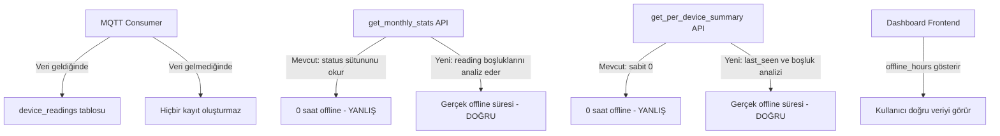

# Offline Hours Hesaplama Düzeltme Planı

## Sorun Özeti

Dashboard'da M3 (Çiçekçi) cihazı Nisan ayı için **0 saat offline** gösteriyor, ancak cihaz gerçekten kapalı/offline durumda.

## Kök Neden Analizi

### Sorun 1: `get_monthly_stats` - device_offline_hours hesaplaması (Kritik)

**Dosya:** `backend/app/api/v1/charts.py` satır 1483-1553

**Mevcut Mantık:**
- `DeviceReading.status` sütunundaki `offline` değerlerini arıyor
- Offline başlangıç/bitiş timestamp'leri arasındaki farkı hesaplıyor

**Neden Çalışmıyor:**
- MQTT consumer (`_save_reading`) sadece cihazdan **veri geldiğinde** reading oluşturuyor
- Cihaz kapalıyken hiçbir reading kaydı üretilmiyor
- Dolayısıyla `status='offline'` olan kayıtlar hiç oluşmuyor
- Sonuç: offline_hours her zaman 0

### Sorun 2: `get_per_device_summary` - offline_hours sabit 0

**Dosya:** `backend/app/api/v1/charts.py` satır 427

**Mevcut Mantık:**
```python
offline_hours = 0.0  # Sabit 0, hiç hesaplama yapılmıyor
```

### Sorun 3: `get_all_devices_chart_data` - offline hesaplaması eksik

**Dosya:** `backend/app/api/v1/charts.py` satır 764-799

**Mevcut Mantık:**
- Sadece `device_period_data` içinde veri olup olmadığına bakıyor
- `last_seen_at` ile period arasındaki ilişkiyi yanlış kuruyor
- Gerçek offline süresini hesaplamıyor

## Çözüm Yaklaşımı: Veri Boşluğu Analizi

Offline süresini hesaplamak için **reading boşluklarını** analiz etmeliyiz:

1. Her cihaz için ay içindeki tüm reading'leri timestamp sırasına göre al
2. İki ardışık reading arasındaki boşlukları hesapla
3. Eğer boşluk belirli bir eşikten (örn: 30 dakika) büyükse, o boşluk offline süresi olarak say
4. Ayın başlangıcından ilk reading'e kadar olan süre de offline sayıl
5. Son reading'den ayın sonuna (veya şu ana) kadar olan süre de offline sayıl

### Algoritma Detayı

```
Her cihaz için:
  1. Ay başlangıcı = month_start (örn: 2026-04-01 00:00:00)
  2. Ay bitişi = min(month_end, now) (geleceği hesaba katma)
  3. Cihazın bu ay içindeki tüm reading timestamp'lerini al (sıralı)
  
  Eğer hiç reading yoksa:
    offline_hours = (ay_bitis - ay_baslangic) saat
  Eğer reading varsa:
    offline_hours = 0
    
    // Ay başından ilk reading'e kadar
    ilk_reading = readings[0].timestamp
    gap_start = max(month_start, device.last_seen_at_baslangic) // Cihazın ilk görülme zamanından öncesi sayılmaz
    gap = ilk_reading - ay_baslangic
    eğer gap > 30 dk: offline_hours += gap
    
    // Reading'ler arası boşluklar
    for i in range(1, len(readings)):
      gap = readings[i].timestamp - readings[i-1].timestamp
      eğer gap > 30 dk: offline_hours += gap
    
    // Son reading'den ay bitişine kadar
    gap = ay_bitis - readings[-1].timestamp
    eğer gap > 30 dk: offline_hours += gap
```

## Değişiklik Planı

### 1. Backend: `get_monthly_stats` - device_offline_hours düzeltmesi

**Dosya:** `backend/app/api/v1/charts.py` satır 1483-1553

**Değişiklik:** Mevcut `DeviceReading.status` tabanlı hesaplamayı kaldır, yerine veri boşluğu analizine dayalı hesaplama ekle.

**Yeni mantık:**
- Her cihaz için ay içindeki reading timestamp'lerini al
- Reading'ler arası boşlukları hesapla (30 dk üstü = offline)
- Ay başlangıcı/sonu ile reading'ler arası boşlukları da dahil et
- Cihazın `last_seen_at` değerini referans alarak cihazın ne zaman ilk görüldüğünü hesaba kat

### 2. Backend: `get_per_device_summary` - offline_hours düzeltmesi

**Dosya:** `backend/app/api/v1/charts.py` satır 427

**Değişiklik:** Sabit 0 yerine, seçilen periyot için gerçek offline hesaplaması yap.

**Yeni mantık:**
- Cihazın `last_seen_at` değerini kontrol et
- Eğer cihaz offline ise: `(now - last_seen_at)` süresini hesapla
- Periyot içindeki reading boşluklarını analiz et

### 3. Backend: `get_all_devices_chart_data` - offline hesaplama iyileştirmesi

**Dosya:** `backend/app/api/v1/charts.py` satır 764-799

**Değişiklik:** Her period slot için, cihazın o slot içinde veri gönderip göndermediğini kontrol et. Veri yoksa ve cihaz o dönemde aktif olmalıysa offline say.

### 4. Frontend: Doğrulama

Frontend'de bir değişiklik gerekmiyor - mevcut yapı `offline_hours` alanını doğru kullanıyor. Sorun backend'den gelen veride.

## Veritabanı Uyumluluğu

- Deploy ortamı: **PostgreSQL (TimescaleDB)** - `func.extract`, `date_trunc` çalışır
- Geliştirme ortamı: **SQLite** - `strftime` kullanılmalı
- Çözüm: SQLAlchemy ORM kullanarak her iki veritabanıyla uyumlu sorgular yazılacak

## Etki Alanı



## Test Senaryoları

1. **Cihaz hiç veri göndermemiş:** Ayın tamamı offline olmalı
2. **Cihaz sürekli veri gönderiyor:** 0 saat offline olmalı
3. **Cihaz 2 gün veri göndermemiş:** 48 saat offline olmalı
4. **Cihaz ayın ortasında kapanmış:** Kapanma anından bugüne kadar offline olmalı
5. **Cihaz ayın ortasında açılmış:** Açılma anına kadar offline olmalı
