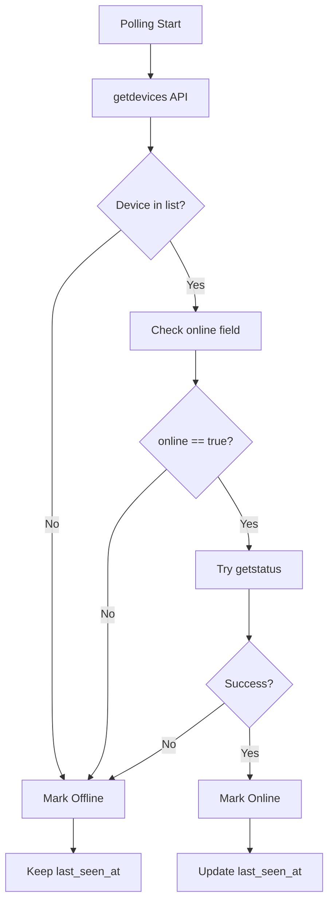

# Tuya Cihazları Geliştirme Planı

## Problem Tanımı

1. **Online/Offline Sorunu**: Cihaz fiziksel olarak takılı olmasa bile yenile yapıldığında "online" görünüyor
2. **Kontrol Kaydı**: Açma/kapama işlemleri kayıt altına alınmıyor
3. **Otomatik Kontrol**: 10 dakikada bir otomatik cihaz kontrolü yok
4. **Detay Sayfası**: Cihaz detaylarını ve geçmişini gösteren sayfa eksik

## Kök Neden Analizi

Mevcut [`tuya_service.py`](../backend/app/services/tuya_service.py) kodunda:
- `getstatus()` API çağrısı başarılı olduğunda cihaz her zaman `online` işaretleniyor
- Tuya Cloud API, cihaz offline olsa bile cached status döndürebiliyor
- `getdevices()` API'sindeki `online` field kullanılmıyor
- Kontrol işlemleri için audit log mekanizması yok

## Çözüm Mimarisi

```mermaid
flowchart TB
    subgraph Frontend
        A[Tuya Devices Page]
        B[Device Detail Page]
        C[Control History Table]
    end

    subgraph Backend API
        D[GET /tuya-devices]
        E[GET /tuya-devices/{id}/details]
        F[GET /tuya-devices/{id}/control-history]
        G[POST /tuya-devices/{id}/control]
    end

    subgraph Services
        H[TuyaService]
        I[ControlLogService]
    end

    subgraph Database
        J[tuya_devices]
        K[tuya_device_control_logs]
    end

    subgraph External
        L[Tuya Cloud API]
    end

    A --> D
    B --> E
    B --> F
    A --> B
    C --> F

    D --> H
    E --> H
    F --> I
    G --> H
    G --> I

    H --> L
    H --> J
    I --> K

    L -.->|Polling 10min| H
```

## Online/Offline Tespit Mekanizması



## Veritabanı Şeması

### tuya_device_control_logs Tablosu

| Column | Type | Description |
|--------|------|-------------|
| id | Integer | Primary Key |
| tuya_device_id | Integer | FK to tuya_devices.id |
| action | String | turn_on, turn_off, toggle |
| previous_state | Boolean | Power state before action |
| new_state | Boolean | Power state after action |
| success | Boolean | Was action successful |
| error_message | Text | Error if failed |
| performed_by | String | User who performed action |
    performed_at | DateTime | When action was performed |
    created_at | DateTime | Record creation time |

## Backend Değişiklikleri

### 1. Yeni Model: TuyaDeviceControlLog

**Dosya**: [`backend/app/models/tuya_device_control_log.py`](../backend/app/models/tuya_device_control_log.py)

```python
class TuyaDeviceControlLog(Base):
    __tablename__ = "tuya_device_control_logs"
    
    id: Mapped[int] = mapped_column(Integer, primary_key=True)
    tuya_device_id: Mapped[int] = mapped_column(Integer, ForeignKey("tuya_devices.id"))
    action: Mapped[str] = mapped_column(String(20))
    previous_state: Mapped[bool] = mapped_column(Boolean)
    new_state: Mapped[bool] = mapped_column(Boolean, nullable=True)
    success: Mapped[bool] = mapped_column(Boolean)
    error_message: Mapped[Optional[str]] = mapped_column(Text)
    performed_by: Mapped[Optional[str]] = mapped_column(String(100))
    performed_at: Mapped[datetime] = mapped_column(DateTime(timezone=True))
    created_at: Mapped[datetime] = mapped_column(DateTime(timezone=True), default=datetime.utcnow)
```

### 2. TuyaService Güncellemeleri

**Dosya**: [`backend/app/services/tuya_service.py`](../backend/app/services/tuya_service.py)

**Değişiklikler**:
- `_poll_all_devices()` metodunda `getdevices()` API'sinden `online` field'ı oku
- `getstatus()` başarısız olduğunda cihazı offline işaretle
- `control_device()` metodunda kontrol kaydı oluştur
- `get_control_history()` metodu ekle

### 3. Yeni API Endpoints

**Dosya**: [`backend/app/api/v1/tuya_devices.py`](../backend/app/api/v1/tuya_devices.py)

```python
# Yeni endpoint'ler
GET  /api/v1/tuya-devices/{id}/details        # Cihaz detayı + son kontrol kayıtları
GET  /api/v1/tuya-devices/{id}/control-history  # Kontrol geçmişi (sayfalı)
```

### 4. Config Güncellemesi

**Dosya**: [`backend/app/config.py`](../backend/app/config.py)

```python
TUYA_POLL_INTERVAL_SECONDS: int = 600  # 10 dakika
```

## Frontend Değişiklikleri

### 1. Yeni Detay Sayfası

**Dosya**: [`frontend/src/app/(dashboard)/tuya-devices/[id]/page.tsx`](../frontend/src/app/(dashboard)/tuya-devices/[id]/page.tsx)

**Özellikler**:
- Cihaz bilgileri kartı
- Anlık durum göstergesi (online/offline, power state)
- Kontrol butonları
- Kontrol geçmişi tablosu
- Son görülme zamanı

### 2. Type Güncellemeleri

**Dosya**: [`frontend/src/types/tuya.ts`](../frontend/src/types/tuya.ts)

```typescript
export interface TuyaDeviceControlLog {
  id: number;
  tuya_device_id: number;
  action: string;
  previous_state: boolean;
  new_state: boolean | null;
  success: boolean;
  error_message: string | null;
  performed_by: string | null;
  performed_at: string;
  created_at: string;
}

export interface TuyaDeviceDetails extends TuyaDevice {
  control_history: TuyaDeviceControlLog[];
  total_controls: number;
  successful_controls: number;
  failed_controls: number;
}
```

### 3. Ana Sayfa Güncellemesi

**Dosya**: [`frontend/src/app/(dashboard)/tuya-devices/page.tsx`](../frontend/src/app/(dashboard)/tuya-devices/page.tsx)

- Her cihaz kartına "Detaylar" butonu ekle
- Cihaz ismine tıklandığında detay sayfasına git

## API Endpoint'leri

| Method | Endpoint | Açıklama |
|--------|----------|----------|
| GET | `/api/v1/tuya-devices` | Tüm cihazları listele |
| GET | `/api/v1/tuya-devices/{id}` | Tek cihaz bilgisi |
| GET | `/api/v1/tuya-devices/{id}/details` | Cihaz detayı + geçmiş |
| GET | `/api/v1/tuya-devices/{id}/control-history` | Kontrol geçmişi |
| POST | `/api/v1/tuya-devices/{id}/control` | Cihaz kontrol et |
| POST | `/api/v1/tuya-devices/{id}/toggle` | Cihaz toggle |

## Migration Planı

### Alembic Migration

**Dosya**: `backend/alembic/versions/XXX_add_tuya_device_control_logs.py`

```python
def upgrade():
    op.create_table(
        'tuya_device_control_logs',
        sa.Column('id', sa.Integer(), primary_key=True),
        sa.Column('tuya_device_id', sa.Integer(), sa.ForeignKey('tuya_devices.id')),
        sa.Column('action', sa.String(20), nullable=False),
        sa.Column('previous_state', sa.Boolean(), nullable=False),
        sa.Column('new_state', sa.Boolean(), nullable=True),
        sa.Column('success', sa.Boolean(), nullable=False),
        sa.Column('error_message', sa.Text(), nullable=True),
        sa.Column('performed_by', sa.String(100), nullable=True),
        sa.Column('performed_at', sa.DateTime(timezone=True), nullable=False),
        sa.Column('created_at', sa.DateTime(timezone=True), nullable=False),
        sa.Index('idx_tuya_device_id', 'tuya_device_id'),
        sa.Index('idx_performed_at', 'performed_at'),
    )
```

## Test Senaryoları

### 1. Online/Offline Tespit
- [ ] Cihaz fişi çekildiğinde offline görünmeli
- [ ] Cihaz fişi takıldığında online görünmeli
- [ ] 10 dakika sonra otomatik kontrol çalışmalı
- [ ] `last_seen_at` doğru güncellenmeli

### 2. Kontrol Kaydı
- [ ] Açma işlemi kayda geçmeli
- [ ] Kapama işlemi kayda geçmeli
- [ ] Başarısız işlem kayda geçmeli
- [ ] Kullanıcı bilgisi kayda geçmeli

### 3. Detay Sayfası
- [ ] Cihaz bilgileri doğru gösterilmeli
- [ ] Kontrol geçmişi listelenmeli
- [ ] Sayfalama çalışmalı
- [ ] Geri dönüş butonu çalışmalı

## Deployment Adımları

1. Backend kodlarını güncelle
2. Migration çalıştır: `alembic upgrade head`
3. Frontend kodlarını güncelle
4. Frontend build: `npm run build`
5. Backend restart
6. Test senaryolarını çalıştır

## İlerleme Takibi

- [x] Mevcut kod analizi
- [x] Plan hazırlama
- [ ] Backend model oluşturma
- [ ] Backend service güncelleme
- [ ] Backend API endpoint'leri
- [ ] Migration hazırlama
- [ ] Frontend type güncellemeleri
- [ ] Frontend detay sayfası
- [ ] Frontend ana sayfa güncellemesi
- [ ] Test ve doğrulama
