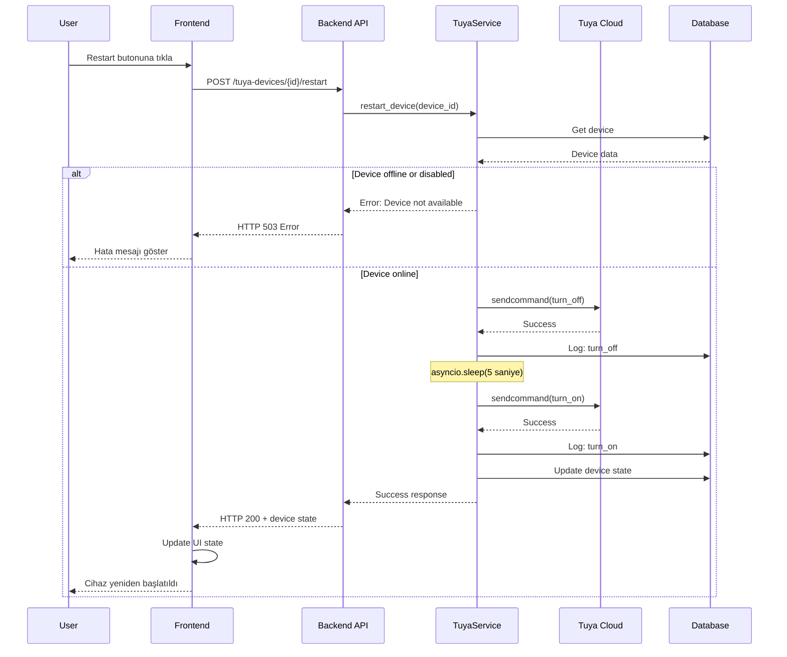

# Tuya Cihaz Restart Özelliği - Teknik Plan

## Genel Bakış

Tuya akıllı prizlere **Restart** (Yeniden Başlatma) özelliği eklenmesi. Bu özellik, cihazı kapatıp belirli bir bekleme süresi sonrasında tekrar açacak.

## Problem Tanımı

**Mevcut Durum:**
- Kullanıcı cihazı "Kapat" butonuyla kapattığında, cihaz offline oluyor
- Cihaz offline olunca internet bağlantısı kesiliyor
- "Aç" komutu cihaza ulaşamıyor çünkü cihaz artık networkte değil

**İhtiyaç:**
- Tek bir işlemle cihazı kapat -> bekle -> aç sıralamasını gerçekleştirmek
- Her iki komut da cihaz hala online'ken gönderilmeli
- İşlem async olmalı ama kullanıcı tek butonla tetiklemeli

## Teknik Çözüm

### Yaklaşım: Sequential Commands with Delay

1. **Backend'de `restart` action'ı oluştur**
2. Cihaz online'ken:
   - İlk komut: `turn_off` gönder
   - Bekleme: 5-10 saniye (configurable)
   - İkinci komut: `turn_on` gönder
3. Her iki komutu da cloud API'ye peş peşe gönder
4. Control log'a restart kaydı tut

### Bekleme Süresi

- **Önerilen:** 5 saniye
- **Neden:** Çoğu akıllı priz 2-3 saniyede tepki verir
- **Configurable:** Environment variable olarak ayarlanabilir

```python
TUYA_RESTART_DELAY_SECONDS = 5  # Varsayılan: 5 saniye
```

## Mimari Değişiklikler

### 1. Backend - Service Layer

**Dosya:** `backend/app/services/tuya_service.py`

**Yeni Metod:** `restart_device()`

```python
async def restart_device(
    self, 
    db: AsyncSession, 
    device_id: int, 
    delay_seconds: int = 5,
    performed_by: Optional[str] = None
) -> Dict[str, Any]:
    """
    Restart a Tuya device by turning it off, waiting, then turning it on.
    
    Args:
        db: Database session
        device_id: Internal device ID
        delay_seconds: Seconds to wait between off and on commands
        performed_by: Optional username/identifier
        
    Returns:
        Dict with success status and final power state
    """
```

**İşlem Akışı:**
1. Cihazı veritabanından getir
2. Cihazın online ve enabled olduğunu kontrol et
3. `turn_off` komutunu gönder
4. `asyncio.sleep(delay_seconds)` ile bekle
5. `turn_on` komutunu gönder
6. Her iki işlemi de log'a kaydet
7. Sonucu döndür

### 2. Backend - API Layer

**Dosya:** `backend/app/api/v1/tuya_devices.py`

**Yeni Endpoint:**

```python
@router.post("/{device_id}/restart", response_model=TuyaDeviceControlResponse)
async def restart_tuya_device(
    device_id: int,
    delay_seconds: int = Query(5, ge=2, le=30, description="Delay between off and on"),
    db: AsyncSession = Depends(get_db),
):
    """
    Restart a Tuya device (turn off, wait, turn on).
    Useful for devices that lose connectivity when turned off.
    """
```

**HTTP Method:** POST  
**Path:** `/api/v1/tuya-devices/{device_id}/restart`  
**Query Params:** `delay_seconds` (optional, default: 5)

### 3. Backend - Schema Layer

**Dosya:** `backend/app/schemas/tuya_device.py`

**Güncelleme:**

```python
class TuyaDeviceControlRequest(BaseModel):
    """Schema for device control request."""
    action: str  # 'turn_on', 'turn_off', 'toggle', 'restart'
```

**Yeni Schema:**

```python
class TuyaDeviceRestartRequest(BaseModel):
    """Schema for device restart request."""
    delay_seconds: int = 5  # Bekleme süresi (saniye)
    
    @field_validator('delay_seconds')
    def validate_delay(cls, v: int) -> int:
        if v < 2 or v > 30:
            raise ValueError('delay_seconds must be between 2 and 30')
        return v
```

### 4. Frontend - API Client

**Dosya:** `frontend/src/lib/api.ts`

**Yeni Endpoint:**

```typescript
tuyaDeviceRestart: (id: number) => `/api/v1/tuya-devices/${id}/restart`,
```

### 5. Frontend - Type Definitions

**Dosya:** `frontend/src/types/tuya.ts`

**Güncelleme:**

```typescript
export interface TuyaDeviceControlRequest {
  action: 'turn_on' | 'turn_off' | 'toggle' | 'restart';
  delay_seconds?: number; // Restart için opsiyonel
}

export interface TuyaDeviceRestartRequest {
  delay_seconds?: number; // Default: 5
}
```

### 6. Frontend - UI Component

**Dosya:** `frontend/src/app/(dashboard)/tuya-devices/page.tsx`

**Yeni State:**

```typescript
const [restartingDevice, setRestartingDevice] = useState<number | null>(null);
```

**Yeni Fonksiyon:**

```typescript
// Restart device (turn off -> wait -> turn on)
const restartDevice = async (deviceId: number, delaySeconds: number = 5) => {
  setRestartingDevice(deviceId);
  try {
    const result = await api.post<TuyaDeviceControlResponse>(
      `${endpoints.tuyaDeviceRestart(deviceId)}?delay_seconds=${delaySeconds}`
    );

    if (result.success) {
      setDevices(prev =>
        prev.map(device =>
          device.id === deviceId
            ? { ...device, power_state: result.power_state, last_control_at: new Date().toISOString() }
            : device
        )
      );
    }
  } catch (err) {
    console.error('Failed to restart device:', err);
    setError('Cihaz yeniden başlatılırken bir hata oluştu');
  } finally {
    setRestartingDevice(null);
  }
};
```

**Yeni UI Buton:**

```tsx
<Button
  variant="outline"
  size="sm"
  onClick={() => restartDevice(device.id)}
  disabled={restartingDevice === device.id || controllingDevice === device.id}
  title="Yeniden Başlat (Kapat -> Bekle -> Aç)"
>
  {restartingDevice === device.id ? (
    <Loader2 className="h-4 w-4 animate-spin" />
  ) : (
    <RotateCcw className="h-4 w-4" />
  )}
</Button>
```

## İşlem Akış Diyagramı



## Veri Modeli

### Control Log Kayıtları

Restart işlemi için **2 ayrı log** kaydı oluşturulacak:

1. **Turn Off Log:**
```json
{
  "action": "restart_off",
  "previous_state": true,
  "new_state": false,
  "success": true,
  "performed_by": "user@example.com"
}
```

2. **Turn On Log:**
```json
{
  "action": "restart_on",
  "previous_state": false,
  "new_state": true,
  "success": true,
  "performed_by": "user@example.com"
}
```

## Error Handling

### Backend Error Scenarios

1. **Cihaz bulunamadı**
   - HTTP 404: "Device not found"

2. **Cihaz offline**
   - HTTP 503: "Device is offline, cannot restart"

3. **Cihaz disabled**
   - HTTP 503: "Device is disabled"

4. **Turn off başarısız**
   - Log kaydet, işlemi durdur
   - HTTP 503: "Failed to turn off device"

5. **Turn on başarısız**
   - Log kaydet (off başarılı, on başarısız)
   - HTTP 503: "Device turned off but failed to turn back on"

### Frontend Error Handling

```typescript
try {
  await restartDevice(deviceId);
} catch (err: any) {
  if (err.status === 503) {
    setError('Cihaz offline veya ulaşılamıyor');
  } else if (err.status === 404) {
    setError('Cihaz bulunamadı');
  } else {
    setError('Cihaz yeniden başlatılırken beklenmeyen hata');
  }
}
```

## UI/UX Tasarım

### Buton Yerleşimi

Cihaz kartında mevcut butonların yanına eklenecek:

```
[Kapat/Aç]  [Toggle]  [Durum Yenile]  [🔄 Restart]  [Sil]
```

### Buton Özellikleri

- **İkon:** RotateCcw (lucide-react)
- **Renk:** Outline variant (nötr)
- **Tooltip:** "Yeniden Başlat (Kapat -> 5sn bekle -> Aç)"
- **Loading State:** Spinner animasyonu
- **Disabled State:** 
  - Cihaz zaten kontrol ediliyorsa
  - Cihaz offline ise

### Kullanıcı Bildirimleri

1. **Başarılı restart:**
   ```
   ✓ {device.name} yeniden başlatıldı
   ```

2. **Başarısız restart:**
   ```
   ✗ {device.name} yeniden başlatılamadı: {error}
   ```

## Konfigürasyon

### Environment Variables

**Backend (.env):**

```bash
# Tuya restart delay (seconds)
TUYA_RESTART_DELAY_SECONDS=5
```

**Config.py'ye ekleme:**

```python
# backend/app/config.py
class Settings(BaseSettings):
    # ... existing settings ...
    
    TUYA_RESTART_DELAY_SECONDS: int = 5
```

## Test Senaryoları

### Unit Tests

1. **Service Layer Test:**
   - `test_restart_device_success()`
   - `test_restart_device_offline_fails()`
   - `test_restart_device_disabled_fails()`
   - `test_restart_device_turn_off_fails()`
   - `test_restart_device_turn_on_fails()`

2. **API Layer Test:**
   - `test_restart_endpoint_success()`
   - `test_restart_endpoint_invalid_delay()`
   - `test_restart_endpoint_device_not_found()`

### Integration Tests

1. **End-to-End Test:**
   - Cihazı restart et
   - Her iki log kaydının oluştuğunu doğrula
   - Final durumun "on" olduğunu doğrula

### Manual Tests

1. **Online cihaz restart:**
   - ✓ Cihaz kapalıyken restart -> Açılmalı
   - ✓ Cihaz açıkken restart -> Kapanıp tekrar açılmalı

2. **Offline cihaz restart:**
   - ✓ Hata mesajı gösterilmeli

3. **Delay parametresi:**
   - ✓ 2 saniye -> Çalışmalı
   - ✓ 10 saniye -> Çalışmalı
   - ✓ 1 saniye -> Validation hatası
   - ✓ 31 saniye -> Validation hatası

## Performans Considerations

### Timeout Yönetimi

- Backend endpoint timeout: **60 saniye**
- Restart işlemi max süre: **5s (delay) + 10s (command) + 10s (command) = 25s**
- Frontend timeout: **30 saniye**

### Concurrent Requests

- Aynı cihaz için eşzamanlı restart engellenmeli
- Frontend: Button disabled state
- Backend: Optimistic locking yok (stateless)

## Security Considerations

1. **Rate Limiting:**
   - Aynı cihaz için max 1 restart/dakika
   - IP bazlı rate limiting

2. **Authorization:**
   - Sadece authenticated kullanıcılar
   - Cihaz sahibi kontrolü (future)

3. **Input Validation:**
   - delay_seconds: 2-30 arası
   - device_id: Positive integer

## Deployment Plan

### Rollout Strategy

1. **Phase 1: Backend Deploy**
   - Service layer changes
   - API endpoint ekleme
   - Schema güncellemeleri

2. **Phase 2: Frontend Deploy**
   - UI buton ekleme
   - API client güncellemeleri
   - Type definitions

3. **Phase 3: Testing**
   - Production'da seçili cihazlarla test
   - Log monitoring

### Rollback Plan

- Backend: Endpoint'i geçici devre dışı bırak
- Frontend: Butonu UI'dan gizle
- Zero downtime rollback

## Alternatif Yaklaşımlar (İncelendi ve Reddedildi)

### 1. ❌ Client-side delay

**Neden reddedildi:**
- Browser kapanırsa işlem yarıda kalır
- Network hatası durumunda kontrol kaybı
- Tutarlı log kaydı yapılamaz

### 2. ❌ Background job queue

**Neden reddedildi:**
- Basit işlem için overengineering
- Celery/RQ gibi ek dependency
- Sync işlem daha maintainable

### 3. ✅ Sequential async commands (SEÇİLDİ)

**Neden seçildi:**
- Basit ve anlaşılır
- Mevcut yapıyla uyumlu
- Hata yönetimi kolay
- Zero additional dependency

## İleride Eklenebilecek Özellikler

1. **Configurable delay per device:**
   - Her cihaz için farklı bekleme süresi

2. **Retry mechanism:**
   - Turn on başarısız olursa 2-3 kez dene

3. **Notification system:**
   - WebSocket üzerinden real-time bildirim
   - Email/SMS bildirimi (kritik cihazlar için)

4. **Scheduled restart:**
   - Belirli saatte otomatik restart
   - Haftalık/aylık schedule

5. **Bulk restart:**
   - Birden fazla cihazı aynı anda restart

## Referanslar

- Tuya Cloud API Documentation
- TinyTuya Library: https://github.com/jasonacox/tinytuya
- Mevcut tuya_service.py implementasyonu

## Sorumlu Ekip Üyeleri

- Backend Developer: TuyaService restart metodu
- API Developer: REST endpoint
- Frontend Developer: UI components
- QA: Test senaryoları
- DevOps: Deployment

---

**Plan Versiyonu:** 1.0  
**Oluşturulma Tarihi:** 2026-04-01  
**Son Güncelleme:** 2026-04-01  
**Durum:** Ready for Implementation
