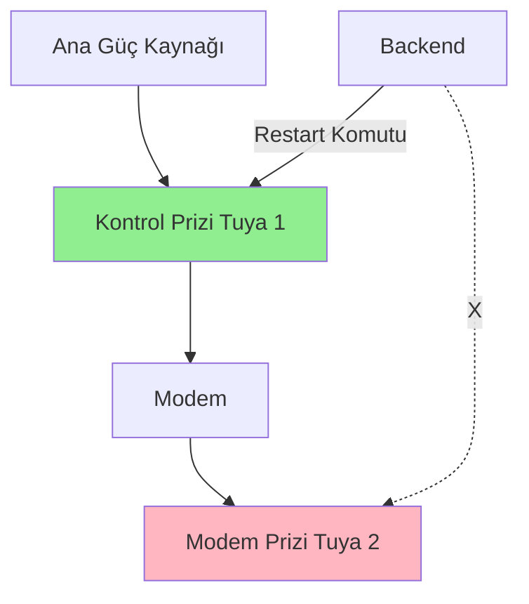

# Tuya Priz Restart - Modem Problemi Analizi

## Problem Tanımı

**Senaryo:** Tuya akıllı priz modeme bağlı. Restart işlemi yapılmak isteniyor.

**Beklenen:** Priz kapat → bekle → aç  
**Gerçekleşen:** Priz kapat → modem kapanır → internet kesilir → "aç" komutu ulaşamaz → priz kapalı kalır ❌

## Teknik Analiz

### Tuya Cloud API İletişim Mekanizması


**Normal İşlem:**
1. Backend → Tuya Cloud: "Prizi kapat"
2. Tuya Cloud → Modem → Priz: Komut iletilir
3. Priz kapanır ✓
4. **5 saniye sonra...**
5. Backend → Tuya Cloud: "Prizi aç"
6. Tuya Cloud → ❌ **MODEM YOK** ❌ → Priz
7. Komut ulaşamaz, priz kapalı kalır

### Neden Çalışmaz?

Tuya prizler **push notification** sistemi kullanmaz. **Polling** sistemi kullanır:

- Priz düzenli aralıklarla (30-60 saniye) Tuya Cloud'a bağlanır
- "Benim için komut var mı?" diye sorar
- Cloud varsa komutu iletir

**Problem:** Priz kapalıysa Cloud'a bağlanamaz → Komut kuyrukta bekler ama priz göremez.

## Çözüm Alternatifleri

### ❌ Çözüm 1: Backend'de Sequential Restart
**Önerilen çözüm ama modemde ÇALIŞMAZ**

```python
async def restart_device():
    await turn_off()  # Priz + Modem kapanır
    await asyncio.sleep(5)
    await turn_on()  # ❌ Komut ulaşamaz çünkü modem yok
```

**Sonuç:** Priz kapalı kalır.

---

### ❌ Çözüm 2: Cloud Komut Kuyruğu
**Tuya Cloud'da komut kuyruğu var ama yeterli değil**

Tuya Cloud komutları kuyrukta tutar:
- Priz offline olunca komut kuyrukta bekler
- Priz online olunca komut çalışır

**Problem:** Priz kapalıysa hiçbir zaman online olmaz!

---

### ⚠️ Çözüm 3: Timer/Schedule Switch
**Hardware özelliği - tüm prizlerde yok**

Bazı Tuya prizlerde "zamanlama" özelliği var:
- "X dakika sonra aç/kapat"
- Bu timer priz içinde çalışır (Cloud'a bağımlı değil)

**Kontrol edelim:**

```python
# Tuya device'ın özelliklerini kontrol et
status = cloud.getstatus(device_id)

# Timer DP'si var mı?
# countdown_1: X saniye sonra kapat/aç
```

**Örnek komut:**

```python
commands = {
    "commands": [
        {"code": "switch_1", "value": False},  # Kapat
        {"code": "countdown_1", "value": 5}    # 5 saniye sonra aç
    ]
}
```

**Avantaj:** Tek komutla restart yapılır, priz kendi içinde timer çalıştırır  
**Dezavantaj:** Tüm prizlerde countdown özelliği olmayabilir

---

### ✅ Çözüm 4: İkinci Fiziksel Cihaz (EN GÜVENLİ)
**Modem prizini başka bir Tuya priz üzerinden kontrol et**



**Mantık:**
1. "Kontrol Prizi" (Tuya 1) ana güce bağlı
2. Modem "Kontrol Prizi"ne bağlı
3. "Modem Prizi" (Tuya 2) modeme bağlı
4. Backend → "Kontrol Prizi"ni restart eder
5. Modem kapanır ama "Kontrol Prizi" hala internete bağlı
6. 5 saniye sonra modem açılır
7. "Modem Prizi" de tekrar online olur

**Avantaj:** %100 çalışır  
**Dezavantaj:** 2 priz gerekir

---

### ✅ Çözüm 5: Watchdog/Heartbeat Mekanizması
**Prizi offline olunca otomatik restart eden sistem**

```python
# Backend'de monitoring servisi
async def monitor_modem_device():
    while True:
        device = await get_device(modem_device_id)
        
        if not device.is_online and device.was_restarting:
            # Priz restart sırasında offline olmuş
            # 30 saniye bekle (modem açılsın)
            await asyncio.sleep(30)
            
            # Hala offline mı?
            if not device.is_online:
                # FIZIKSEL MÜDAHALE GEREK!
                send_alert("Modem prizi restart sonrası açılamadı!")
```

**Mantık:**
- Restart başlatılınca bir flag koy: `restarting=True`
- Priz offline olunca 30-60 saniye bekle
- Hala offline ise alert gönder (SMS/Email)

**Avantaj:** Otomatik monitoring  
**Dezavantaj:** Problem çözmez, sadece bildirir

---

### ⚠️ Çözüm 6: UPS (Kesintisiz Güç Kaynağı)
**Modem UPS'e bağlı, priz modeme değil UPS'e bağlı**

```
[Elektrik] → [Tuya Priz] → [UPS] → [Modem]
```

**Mantık:**
- Priz kapansa bile UPS modem çalıştırır (5-10 dakika)
- Bu sürede priz açılır
- Modem hiç kapanmaz

**Avantaj:** Modem kesintisiz çalışır  
**Dezavantaj:** UPS maliyeti

---

## ÖNERİLEN ÇÖZÜM: Hybrid Yaklaşım

### Çözüm 7: Smart Restart with Validation ✅

**İşlem Akışı:**

```python
async def safe_restart_device(device_id: int):
    device = await get_device(device_id)
    
    # 1. Cihazın tipini kontrol et
    if device.controls_network:
        # Modem/Router priziyse özel işlem
        return {
            "success": False,
            "message": "Bu cihaz internet bağlantısını kontrol ediyor. "
                      "Restart sonrası tekrar açılamayabilir. "
                      "Manuel restart önerilir.",
            "requires_confirmation": True
        }
    
    # 2. Countdown özelliği var mı kontrol et
    has_countdown = await check_countdown_support(device)
    
    if has_countdown:
        # Hardware timer kullan
        return await restart_with_countdown(device)
    else:
        # Normal restart (modem değilse güvenli)
        return await restart_sequential(device)
```

**UI'da:**

```tsx
<Button onClick={() => restartDevice(device.id)}>
  🔄 Restart
</Button>

{/* Modem priziyse uyarı göster */}
{device.controls_network && (
  <Alert variant="warning">
    ⚠️ Bu cihaz modeme bağlı. Restart sonrası tekrar açılamayabilir.
    <Button onClick={() => forceRestart(device.id)}>
      Yine de Restart Et
    </Button>
  </Alert>
)}
```

---

## Uygulama Önerileri

### 1. Cihaz Metadata Ekleme

**Database'e yeni alan:**

```sql
ALTER TABLE tuya_devices ADD COLUMN controls_network BOOLEAN DEFAULT FALSE;
ALTER TABLE tuya_devices ADD COLUMN restart_safe BOOLEAN DEFAULT TRUE;
```

**UI'da işaretle:**

```tsx
<Checkbox
  label="Bu cihaz modemi/router'ı kontrol ediyor"
  checked={device.controls_network}
  onChange={...}
/>
```

### 2. Countdown Desteği Kontrol

```python
async def check_countdown_support(device: TuyaDevice) -> bool:
    """Check if device supports countdown/timer feature."""
    try:
        status = cloud.getstatus(device.device_id)
        dps_codes = [dp.get("code") for dp in status]
        
        # countdown_1, add_ele gibi timer DP'leri ara
        countdown_dps = ["countdown_1", "countdown", "add_ele", "timer"]
        return any(dp in countdown_dps for dp in dps_codes)
    except:
        return False
```

### 3. Multi-Strategy Restart

```python
async def smart_restart(device_id: int) -> Dict:
    """
    Intelligently choose restart strategy based on device capabilities.
    """
    device = await get_device(device_id)
    
    # Strategy 1: Device has countdown
    if await supports_countdown(device):
        logger.info(f"Using countdown strategy for {device.name}")
        return await restart_with_countdown(device, delay=5)
    
    # Strategy 2: Device is network-critical
    elif device.controls_network:
        logger.warning(f"Device {device.name} controls network - unsafe restart")
        return {
            "success": False,
            "error": "NETWORK_CRITICAL_DEVICE",
            "message": "Cihaz internet bağlantısını kontrol ediyor",
            "suggestion": "Manuel restart önerilir"
        }
    
    # Strategy 3: Normal device - safe sequential restart
    else:
        logger.info(f"Using sequential strategy for {device.name}")
        return await restart_sequential(device, delay=5)
```

---

## Sonuç ve Tavsiyeler

### Modem Prizi İçin:

**EN GÜVENLİ:** 
- Manuel restart (fiziksel buton)
- İkinci kontrol prizi sistemi (Çözüm 4)

**YAZILIMSAL:**
- Countdown özelliği varsa kullan (Çözüm 3)
- Yoksa restart butonunu gösterme veya uyarı ver

**YAPILMAMALI:**
- Sequential restart (Backend'de turn_off → sleep → turn_on)
- Kesinlikle çalışmaz

### Normal Priz İçin:

**GÜVENLİ:**
- Sequential restart (Çözüm 1) ✓
- Countdown ile restart (Çözüm 3) ✓

---

## Kod Önerisi

```python
# backend/app/services/tuya_service.py

async def restart_device(
    self,
    db: AsyncSession,
    device_id: int,
    delay_seconds: int = 5,
    force: bool = False
) -> Dict[str, Any]:
    """
    Smart restart with safety checks.
    """
    device = await self.get_device(db, device_id)
    
    # Safety check: Network-critical device
    if device.controls_network and not force:
        raise TuyaCloudError(
            "Bu cihaz internet bağlantısını kontrol ediyor. "
            "Restart sonrası tekrar açılamayabilir. "
            "Onaylamak için force=True parametresi gönderin."
        )
    
    # Try countdown method first
    if await self._supports_countdown(device):
        return await self._restart_with_countdown(db, device, delay_seconds)
    
    # Fallback to sequential
    return await self._restart_sequential(db, device, delay_seconds)
```

---

**Sonuç:** Modem prizine restart özelliği eklemek riskli. Kullanıcıyı uyarmalı veya alternatif yöntemler kullanmalıyız.
