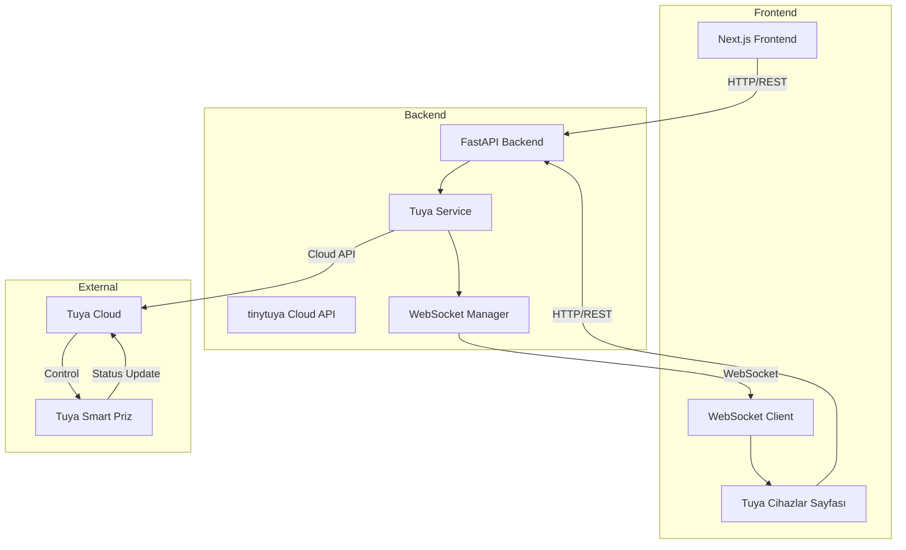

# Tuya Smart Priz Entegrasyon Planı

## Genel Bakış

Tuya Smart WiFi prizini Sumatic Modern IoT sistemine entegre ederek, farklı ağdaki cihazları Tuya Cloud API üzerinden kontrol edeceğiz.

## Mimari Diyagram



## Adım 1: Tuya Cloud API Bilgileri

Gerekli Tuya bilgilerini toplama:

### Tuya Developer Platform'dan Alınacak Bilgiler:
1. **Access ID** (API Key) - Tuya IoT Platform'dan
2. **Access Secret** (API Secret) - Tuya IoT Platform'dan
3. **Device ID** - Tuya uygulamasından cihazın ID'si
4. **Local Key** - İsteğe bağlı, bulut API için gerekli değil

### Tuya Bilgilerini Bulma Yöntemleri:
- **tuya-cli** aracı ile cihaz bilgilerini çekme
- Tuya Smart uygulamasından Device ID'yi kopyalama
- Tuya IoT Platform (https://iot.tuya.com/) üzerinden proje oluşturma

## Adım 2: Backend Değişiklikleri

### 2.1 Bağımlılık Ekleme
`backend/requirements.txt`:
```
tinytuya>=1.13.0
```

### 2.2 Konfigürasyon
`backend/app/config.py`'e ekle:
```python
# Tuya Cloud Configuration
TUYA_ACCESS_ID: Optional[str] = None
TUYA_ACCESS_SECRET: Optional[str] = None
TUYA_API_REGION: str = "eu"  # us, eu, cn, in
TUYA_DEVICE_IDS: Optional[str] = None  # Comma-separated list
```

### 2.3 Database Model
`backend/app/models/tuya_device.py`:
```python
class TuyaDevice(Base):
    __tablename__ = "tuya_devices"
    
    id: Mapped[int] = mapped_column(Integer, primary_key=True)
    device_id: Mapped[str] = mapped_column(String(64), unique=True)
    name: Mapped[str] = mapped_column(String(100))
    device_type: Mapped[str] = mapped_column(String(50))  # plug, switch, etc.
    ip_address: Mapped[Optional[str]] = mapped_column(String(50))
    is_enabled: Mapped[bool] = mapped_column(Boolean, default=True)
    last_seen_at: Mapped[Optional[datetime]] = mapped_column(DateTime)
    created_at: Mapped[datetime] = mapped_column(DateTime, default=datetime.utcnow)
```

### 2.4 Tuya Service
`backend/app/services/tuya_service.py`:
- Tuya Cloud API bağlantısı
- Cihaz durumunu sorgulama
- Cihaz açma/kapama
- Çoklu cihaz desteği
- Hata yönetimi ve yeniden bağlanma

### 2.5 API Endpoints
`backend/app/api/v1/tuya_devices.py`:
- `GET /api/v1/tuya-devices` - Tüm Tuya cihazlarını listele
- `GET /api/v1/tuya-devices/{id}` - Cihaz detayları
- `POST /api/v1/tuya-devices/{id}/toggle` - Aç/Kapa
- `GET /api/v1/tuya-devices/{id}/status` - Durum sorgula
- `POST /api/v1/tuya-devices` - Yeni cihaz ekle

## Adım 3: Frontend Değişiklikleri

### 3.1 Yeni Sayfa
`frontend/src/app/(dashboard)/tuya-devices/page.tsx`:
- Tuya cihazları listesi
- Her cihaz için aç/kapa butonu
- Gerçek zamanlı durum göstergesi
- Cihaz ekleme modal'ı

### 3.2 TypeScript Types
`frontend/src/types/tuya.ts`:
```typescript
interface TuyaDevice {
  id: number;
  device_id: string;
  name: string;
  device_type: string;
  is_enabled: boolean;
  is_online: boolean;
  state: 'on' | 'off';
  last_seen_at: string;
}
```

### 3.3 API Client
`frontend/src/lib/api.ts`'e ekle:
```typescript
// Tuya Devices
getTuyaDevices: () => Promise<TuyaDevice[]>
toggleTuyaDevice: (id: number) => Promise<void>
getTuyaDeviceStatus: (id: number) => Promise<TuyaDevice>
addTuyaDevice: (data: AddTuyaDeviceRequest) => Promise<TuyaDevice>
```

### 3.4 Sidebar Güncelleme
`frontend/src/components/layout/Sidebar.tsx`:
- Yeni menü öğesi: "Akıllı Prizler"

## Adım 4: WebSocket Entegrasyonu

### 4.1 Backend WebSocket
`backend/app/services/tuya_service.py`:
- Periyodik durum kontrolü (polling)
- Değişiklik olduğunda WebSocket broadcast

### 4.2 Frontend WebSocket
`frontend/src/hooks/useTuyaWebSocket.ts`:
- Gerçek zamanlı durum güncellemeleri
- Otomatik yeniden bağlanma

## Adım 5: Güvenlik

### 5.1 API Key Şifreleme
- Tuya Access Secret veritabanında şifreli saklanır
- `app/core/encryption.py` kullanılır

### 5.2 Erişim Kontrolü
- Sadece admin kullanıcılar cihaz ekleyebilir
- Tüm kullanıcılar cihazları görebilir ve kullanabilir

## Adım 6: Test Planı

1. **Birim Testler**
   - Tuya Service mock testleri
   - API endpoint testleri

2. **Entegrasyon Testleri**
   - Gerçek Tuya cihazı ile test
   - WebSocket güncelleme testi

3. **Kullanıcı Testi**
   - Frontend arayüz testi
   - Çoklu cihaz senaryosu

## Adım 7: Deployment

1. `.env` dosyasına Tuya bilgilerini ekle
2. Alembic migration çalıştır
3. Frontend build
4. Docker container restart

## Dosya Yapısı

```
backend/
├── app/
│   ├── models/
│   │   └── tuya_device.py          # YENİ
│   ├── schemas/
│   │   └── tuya_device.py          # YENİ
│   ├── services/
│   │   └── tuya_service.py         # YENİ
│   └── api/
│       └── v1/
│           └── tuya_devices.py     # YENİ
├── alembic/
│   └── versions/
│       └── 006_add_tuya_devices.py # YENİ

frontend/
├── src/
│   ├── types/
│   │   └── tuya.ts                 # YENİ
│   ├── app/(dashboard)/
│   │   └── tuya-devices/
│   │       └── page.tsx            # YENİ
│   ├── components/
│   │   └── tuya/
│   │       ├── TuyaDeviceCard.tsx  # YENİ
│   │       └── AddTuyaDevice.tsx   # YENİ
│   ├── hooks/
│   │   └── useTuyaWebSocket.ts     # YENİ
│   └── lib/
│       └── api.ts                  # GÜNCELLEME
```

## Kullanım Senaryosu

1. Kullanıcı "Akıllı Prizler" sayfasına gider
2. Sistem Tuya Cloud'a bağlanır ve cihazları listeler
3. Kullanıcı prizin durumunu görür (Açık/Kapalı)
4. Kullanıcı butona tıklayarak prizi açar/kapar
5. WebSocket üzerinden tüm bağlı kullanıcılara güncelleme gider
6. Cihaz durumu veritabanına kaydedilir

## Notlar

- Tuya Cloud API rate limitleri vardır (dikkatli kullanım)
- Çoklu cihaz desteği için batch operations düşünülebilir
- Offline mod için local key ile doğrudan cihaza bağlantı opsiyonu
